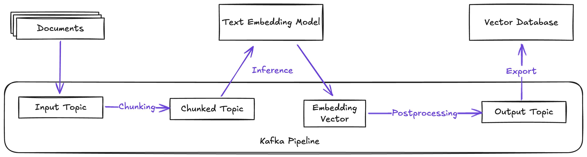

# Kafka Text Embedding Inference

> **_Note:_**  This project is part of my bachelor thesis at the University of Vienna. The thesis and presentation can be found in the `documents` directory.

A streamlined Java library for building Kafka streaming pipelines that generate text embeddings using [huggingface/text-embeddings-inference (TEI)](https://github.com/huggingface/text-embeddings-inference) - a highly optimized inference service.

This library handles the data preparation phase of typical Retrieval Augmented Generation (RAG) pipelines in Kafka by efficiently processing and embedding text at scale.



- Consume messages from Kafka
- Batch messages for optimal processing
- Split messages into chunks
- Generate embeddings using the TEI gRPC API
- Produce enriched messages back to Kafka

### Features

- **Efficient Message Batching**: Optimizes throughput when embedding messages from Kafka
- **Configurable Pipeline**: Easy setup with CLI options for all necessary configurations
- **Customizable Chunking**: Flexible chunking stage
- **Message Serialization**: Support for different serialization formats
- **TEI Service Integration**: Direct integration with huggingface/text-embeddings-inference via gRPC

### Prerequisites

- Running Kafka cluster with topics for input and output  
- Running huggingface/text-embeddings-inference service

### Configuration

```properties
--batch-size         # Kafka batch size (default: 1)
--bootstrap-server   # Kafka bootstrap server address
--schema-registry    # Schema registry URL
--input-topic        # Kafka input topic
--output-topic       # Kafka output topic
--tei-host           # TEI service host
--tei-port           # TEI service port (default: 50051)
```

<br>  

## Demo setup: paper-inference-app

An example implementation that demonstrates how to use the library to:
- Process academic papers from Kafka
- Naively chunk paper abstracts for embedding generation
- Produce embedded papers to Kafka in a format compatible with Qdrant sink connector

It also includes a demo environment using Docker Compose to showcase the pipeline in action.

#### Prerequisites:
- Docker and Docker Compose installed

Start all services by running the command for your system architecture:  
arm64 (e.g. Apple Silicon):  
```bash
docker-compose -f paper-inference-app/demo/docker-compose.yaml -f paper-inference-app/demo/docker-compose.arm64.yaml up -d
```
x86/amd64:  
```bash
docker-compose -f paper-inference-app/demo/docker-compose.yaml up -d
```
> **_Note:_**  Startup may take a few minutes until all services are available

This command launches:  
A fully initialised **Kafka cluster** with topics for input and output  
A **producer** that automatically fetches and produces papers from Europe PMC API  
The **huggingface/text-embeddings-inference** service for generating embeddings  
**Redpanda Console** for monitoring the pipeline  
**Qdrant Vector Database** for storing embedded papers  
Configured **Kafka Connect** instance with Qdrant sink connector that automatically writes embedded papers to Qdrant  
The showcased **paper-inference-app** itself - used for processing and embedding papers

The Redpanda Console dashboard is available at `http://localhost:8080`  
This interface can be used to observe messages flowing through the pipeline, monitor topics, and inspect messages in real-time.  
The Qdrant dashboard is available at `http://localhost:6333/dashboard`

Overview of the services running in the demo setup, when fully initialized:  

Redpanda Console dashboard providing insights into existing topics:  

The input topic, that contains papers fetched from Europe PMC:

This output topic contains embedded papers, ready to be written to Qdrant:

